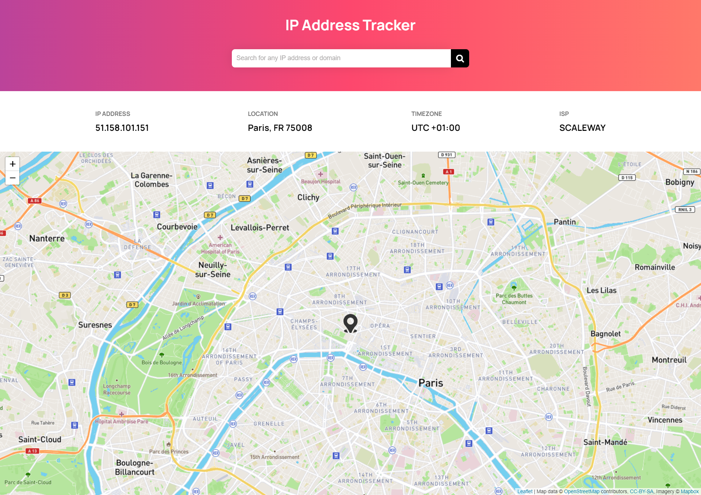

# IP Address Tracker

This app is made for tracking address or domain from the ip address, enter your ip address and it will show your location.

check here https://iptracking.netlify.app/
---

---

### API used in app

-  [IP Geolocation API](https://geo.ipify.org/) for tracking ip.
-  [leaflet js](https://leafletjs.com/) for diplaying map.

_This challange is taken from [Frontend Mentor](https://www.frontendmentor.io/), design changed by me_
